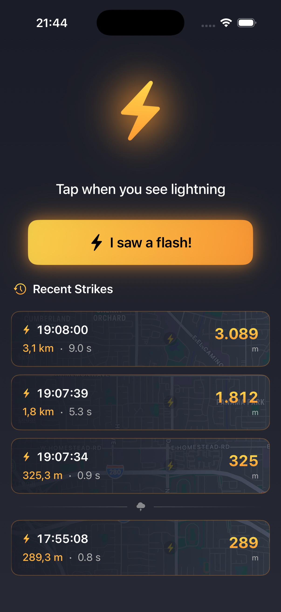

#  Donner

This is a small iOS app to track lightning. Tap a button when you see lightning, tap it again when you hear it. Donner will tell you how far away it is.

If you record the direction by pointing your phone, it will track strikes on a map and show you how the storm is moving.

Why "Donner"? It's German for thunder ⚡

## Screenshots

|  |  |  |  |
|---|---|---|---|
